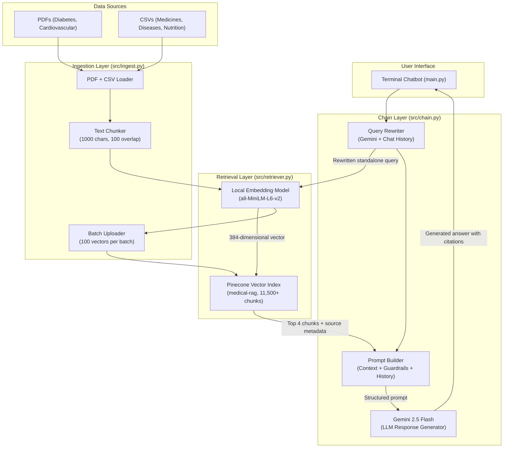
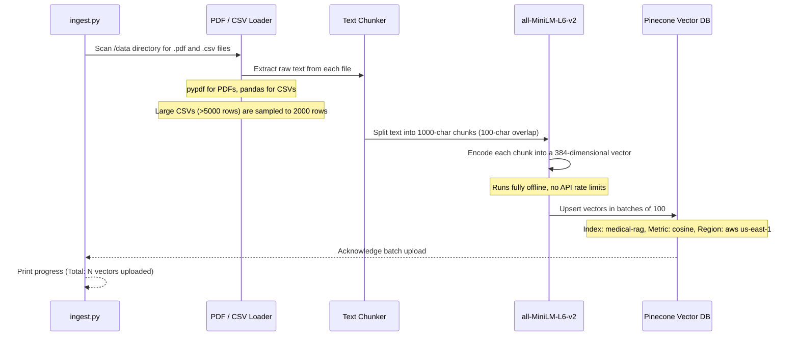
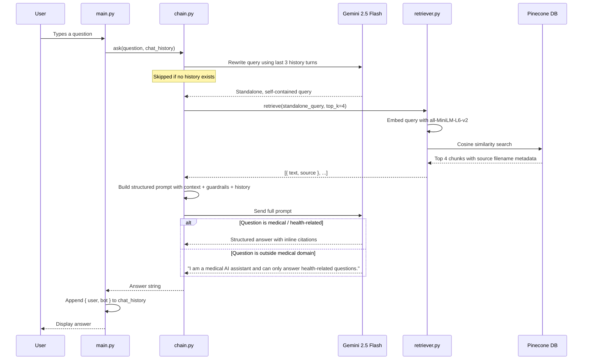

# MediRAG — Conversational Medical RAG System

---

## Table of Contents

1. [Project Overview](#project-overview)
2. [Tech Stack](#tech-stack)
3. [System Architecture](#system-architecture)
4. [Data Ingestion Pipeline](#data-ingestion-pipeline)
5. [Query & Retrieval Pipeline](#query--retrieval-pipeline)
6. [Phase 1 Features — Conversational Upgrades](#phase-1-features--conversational-upgrades)
7. [Dataset Reference](#dataset-reference)
8. [Project Structure](#project-structure)
9. [Installation & Setup](#installation--setup)
10. [Configuration Reference](#configuration-reference)
11. [AI & ML Techniques Summary](#ai--ml-techniques-summary)
12. [Comparison with Existing Medical RAGs](#comparison-with-existing-medical-rags)
13. [Limitations & Roadmap](#limitations--roadmap)

---

## Project Overview

MediRAG is a **conversational medical Retrieval-Augmented Generation (RAG) system** built entirely in Python. It provides accurate, context-aware answers to medical questions by combining a cloud vector database (Pinecone) with a large language model (Google Gemini 2.5 Flash).

Unlike a standard LLM chatbot, MediRAG actively retrieves relevant passages from a curated medical knowledge base before generating any response. This grounding mechanism significantly reduces hallucinations and ensures answers are traceable back to real source documents.

The system implements four core capabilities:

| # | Capability | Description |
|---|-----------|-------------|
| 1 | **Semantic Retrieval** | Embeds queries using a local AI model and searches Pinecone by meaning, not keywords |
| 2 | **Conversational Memory** | Maintains a rolling chat history and understands follow-up questions in context |
| 3 | **Contextual Query Rewriting** | Automatically rewrites vague follow-up questions into standalone, searchable queries |
| 4 | **Medical Guardrails** | Strictly refuses to answer any question outside the domain of medicine and health |

---

## Tech Stack

### Core Runtime

| Technology | Version | Purpose |
|-----------|---------|---------|
| **Python** | 3.10+ | Core application language |
| **python-dotenv** | Latest | Secure API key loading from `.env` |

### AI & Machine Learning

| Technology | Version | Purpose |
|-----------|---------|---------|
| **Google Gemini 2.5 Flash** | via REST API | Answer generation and contextual query rewriting |
| **sentence-transformers** | 5.4+ | Local, offline embedding model (`all-MiniLM-L6-v2`) |
| **torch** | 2.11+ | PyTorch backend required by sentence-transformers |
| **transformers** | 5.7+ | Tokenization pipeline for the embedding model |

### Data & Storage

| Technology | Version | Purpose |
|-----------|---------|---------|
| **Pinecone** | 8.1+ | Serverless cloud vector database for storing and querying embeddings |
| **pypdf** | 6.10+ | Text extraction from PDF source documents |
| **pandas** | 2.3+ | Loading, sampling, and processing CSV datasets |

### API Layer

| Technology | Built-in | Purpose |
|-----------|---------|---------|
| **urllib** | Python stdlib | HTTP requests to the Gemini REST API (no SDK dependency) |
| **json** | Python stdlib | Parsing and serializing API payloads |

---

## System Architecture



### Request Flow (Step by Step)

1. **User types a question** in the terminal chatbot
2. **Query Rewriter** checks if there is conversation history; if so, calls Gemini to rewrite the question as a standalone query
3. **Local Embedding Model** converts the (rewritten) query to a 384-dimensional vector
4. **Pinecone** returns the top 4 most semantically similar chunks from the 11,500+ medical vectors stored in the cloud
5. **Prompt Builder** assembles the retrieved chunks, source citations, conversation history, and medical guardrail instructions into a single structured prompt
6. **Gemini 2.5 Flash** generates a structured, cited medical response
7. The answer is displayed and **saved to chat history** for the next turn

---

## Data Ingestion Pipeline

The ingestion script (`src/ingest.py`) is run once to build the Pinecone knowledge base. It does not need to be run again unless the dataset changes.



### Chunking Strategy

Documents are split using a sliding window to prevent information from being cut off at chunk boundaries:

```
|<----------- Chunk 1 (1000 chars) ----------->|
                          |<-- Overlap: 100 -->|
                          |<----------- Chunk 2 (1000 chars) ----------->|
```

This ensures that a sentence spanning two windows is captured by at least one chunk in its entirety.

---

## Query & Retrieval Pipeline

At runtime, every user question passes through the following pipeline:



---

## Phase 1 Features — Conversational Upgrades

### Contextual Query Rewriting

Before performing a vector search, the system inspects the recent conversation history. If context exists, Gemini rewrites the user's question into a self-contained query that can be searched independently.

| User's Actual Input | Query Sent to Pinecone |
|---------------------|------------------------|
| `"What is Tuberculosis?"` | `"What is Tuberculosis?"` (no history, sent as-is) |
| `"What are its symptoms?"` | `"What are the symptoms of Tuberculosis?"` (rewritten) |
| `"How can I prevent it?"` | `"How can I prevent Tuberculosis?"` (rewritten) |

This mechanism eliminates the retrieval failure that would otherwise occur when users ask natural follow-up questions containing pronouns like "it" or "its."

### Medical Guardrails

The Gemini system prompt contains an explicit instruction that is evaluated on every request:

```
STRICT MEDICAL GUARDRAIL:
You are strictly limited to answering questions related to medicine, health, biology,
diseases, and wellness. If the user's question is NOT about these topics, you MUST reply
exactly with: "I am a medical AI assistant and can only answer health-related questions."
Do not answer the non-medical question.
```

| Test Input | System Response |
|-----------|----------------|
| `"How do I fix my car engine?"` | `"I am a medical AI assistant and can only answer health-related questions."` |
| `"Write me a Python script"` | `"I am a medical AI assistant and can only answer health-related questions."` |
| `"What is hypertension?"` | Full structured medical answer with citations |

### Source Citations

Every chunk retrieved from Pinecone carries its source filename as metadata. The language model is instructed to cite the source inline within the generated answer:

```
Diabetes is a disease characterized by high blood glucose [Source: Diabetes - NIDDK.pdf].
The pancreas produces insulin to allow cells to absorb glucose [Source: train.csv].
```

A **Sources** section at the end of each response lists all unique documents used.

### Chat Memory

The terminal loop in `main.py` maintains a rolling `chat_history` list of the last 5 question-answer pairs. This list is passed to the chain on every request and controls both query rewriting and prompt context injection.

---

## Dataset Reference

The knowledge base is built from 8 curated medical data sources:

| # | File | Type | Source Rows | After Sampling | Topics |
|---|------|------|-------------|----------------|--------|
| 1 | `Diabetes - NIDDK.pdf` | PDF | 58 pages | All pages | Type 1/2 diabetes, insulin, complications |
| 2 | `Cardiovascular diseases.pdf` | PDF | 6 pages | All pages | Heart disease, risk factors, prevention |
| 3 | `A_Z_medicines_dataset_of_India.csv` | CSV | 253,973 | 2,000 | Drug names, compositions, therapeutic use |
| 4 | `Combined Data.csv` | CSV | 53,043 | 2,000 | Disease-symptom mappings |
| 5 | `medquad.csv` | CSV | 16,412 | 2,000 | Medical Q&A pairs sourced from NIH |
| 6 | `train.csv` | CSV | 16,407 | 2,000 | Disease prediction training data |
| 7 | `daily_food_nutrition_dataset.csv` | CSV | 645 | All rows | Nutritional composition of foods |
| 8 | `healthy_eating_dataset.csv` | CSV | 2,000 | All rows | Healthy eating guidelines |

**Total vectors in Pinecone after ingestion:** 11,500+

---

## Project Structure

```
Medical - RAG/
|
|-- main.py                   Entry point: interactive terminal chatbot with memory
|-- requirements.txt          Python package dependencies
|-- .env                      API keys (NOT committed to version control)
|-- .gitignore                Excludes .env, caches, and build artifacts
|-- README.md                 This document
|
|-- src/
|   |-- chain.py              Core RAG logic: query rewriting, prompt assembly, guardrails
|   |-- retriever.py          Pinecone semantic search with source metadata return
|   `-- ingest.py             One-time ingestion: load -> chunk -> embed -> upload
|
|-- data/                     Medical source datasets (PDFs and CSVs)
|   |-- Cardiovascular diseases.pdf
|   |-- Diabetes - NIDDK.pdf
|   |-- A_Z_medicines_dataset_of_India.csv
|   |-- Combined Data.csv
|   |-- medquad.csv
|   |-- train.csv
|   |-- daily_food_nutrition_dataset.csv
|   `-- healthy_eating_dataset.csv
|
`-- tests/                    Reserved for automated tests
```

---

## Installation & Setup

### Prerequisites

- Python 3.10 or higher
- A free [Pinecone account](https://www.pinecone.io/) (the Starter plan is sufficient)
- A [Google AI Studio API key](https://aistudio.google.com/app/apikey) for Gemini

### Step 1 — Clone the Repository

```bash
git clone https://github.com/YOUR_USERNAME/medical-rag.git
cd medical-rag
```

### Step 2 — Install Dependencies

```bash
pip install -r requirements.txt
```

> Note: This installs `torch` and `sentence-transformers`, which together require approximately 500 MB of disk space. The download occurs once; subsequent runs load from the local cache.

### Step 3 — Configure Environment Variables

Create a `.env` file in the project root with the following keys:

```
GEMINI_API_KEY=your_google_gemini_api_key_here
PINECONE_API_KEY=your_pinecone_api_key_here
```

| Variable | How to Obtain |
|---------|--------------|
| `GEMINI_API_KEY` | [Google AI Studio](https://aistudio.google.com/app/apikey) — Create API Key |
| `PINECONE_API_KEY` | [Pinecone Console](https://app.pinecone.io/) — API Keys section |

> **Important:** Never commit the `.env` file to version control. It is already excluded by `.gitignore`.

### Step 4 — Run Data Ingestion

This step processes all files in `/data`, generates embeddings locally, and uploads them to Pinecone. It only needs to be run once.

```bash
python src/ingest.py
```

Expected output:

```
[*] Loading local embedding model (all-MiniLM-L6-v2)...
[*] Connecting to Pinecone...
[*] Creating new Pinecone index: 'medical-rag'...
[*] Loading documents...
[*] Found 8 files to process.
...
[*] Uploading batch of 100 to Pinecone... (Total: 0)
[*] Uploading batch of 100 to Pinecone... (Total: 100)
...
[OK] Ingestion complete! Uploaded 11500 embedded chunks to Pinecone.
```

Estimated duration: 5 to 10 minutes depending on hardware. No internet connection is required for the embedding step — only for uploading to Pinecone.

### Step 5 — Start the Chatbot

```bash
python main.py
```

---

## Configuration Reference

The ingestion script exposes several parameters at the top of `src/ingest.py`:

| Parameter | Default | Description |
|-----------|---------|-------------|
| `CHUNK_SIZE` | `1000` | Number of characters per text chunk |
| `CHUNK_OVERLAP` | `100` | Character overlap between consecutive chunks |
| `LARGE_FILE_THRESHOLD` | `5000` | CSV files with more rows than this value are sampled |
| `MAX_ROWS_LARGE_FILE` | `2000` | Maximum rows sampled from large CSV files |
| `PINECONE_INDEX_NAME` | `medical-rag` | Name of the Pinecone index to create or use |
| `EMBEDDING_DIMENSION` | `384` | Vector dimension for `all-MiniLM-L6-v2` |

---

## AI & ML Techniques Summary

| Technique | Where Applied | How It Works |
|-----------|--------------|-------------|
| **Semantic Embedding** | Ingestion + Retrieval | `all-MiniLM-L6-v2` converts text chunks and queries into 384-dimensional vectors representing semantic meaning |
| **Cosine Similarity Search** | Pinecone retrieval | Measures the angular distance between the query vector and stored document vectors; returns the most semantically similar chunks |
| **Sliding Window Chunking** | Ingestion | Documents are split into overlapping 1000-character windows to preserve context at boundaries |
| **CSV Row Sampling** | Ingestion | Large CSV files are randomly sampled (via pandas) to a manageable row count, ensuring representation without overloading the index |
| **Prompt Engineering** | Chain layer | Carefully structured system instructions are injected into the Gemini prompt to enforce guardrails, response format, and citation requirements |
| **Contextual Query Rewriting** | Chain layer | Gemini is called with the last 3 conversation turns to transform follow-up questions into self-contained queries before retrieval |
| **Structured Output via Prompting** | Chain layer | The LLM is instructed to use a defined response format (Overview, Key Information, Sources) with inline citations |
| **Conversational Memory** | `main.py` | A rolling list of the last 5 question-answer pairs is maintained in memory and passed to the chain on every request |

---

## Comparison with Existing Medical RAGs

| Capability | Basic LLM Chatbot | Keyword-Search RAG | **MediRAG** |
|-----------|------------------|--------------------|-------------|
| Answers grounded in source documents | No | Yes | Yes |
| Retrieval based on semantic meaning | No | No | Yes |
| Understands follow-up questions | Yes | No | Yes |
| Domain guardrails (rejects off-topic questions) | No | No | Yes |
| Inline source citations | No | Partial | Yes |
| Offline embedding (no API rate limits) | No | Varies | Yes |
| Cloud-hosted vector database | No | No | Yes |
| Traceable, auditable answers | No | Partial | Yes |

---

## Limitations & Roadmap

### Current Limitations

| Limitation | Detail |
|-----------|--------|
| **General-purpose embeddings** | `all-MiniLM-L6-v2` is a general English model. Medical-domain models such as `ClinicalBERT` or `MedCPT` would improve retrieval accuracy for clinical terminology |
| **Gemini free-tier rate limits** | The LLM has a daily request cap on the free tier. A paid plan is required for production-level throughput |
| **No re-ranking** | Pinecone results are returned in order of cosine similarity. A cross-encoder re-ranker would further improve the relevance of the top chunks sent to the LLM |
| **No hybrid search** | Only vector search is performed. A hybrid approach combining semantic search with BM25 keyword matching would improve recall for specific drug or compound names |
| **In-memory chat history** | Conversation history is stored in the Python process and is lost when the program exits. A persistent store (e.g., SQLite, Redis) is needed for production |

### Planned Roadmap

| Phase | Feature | Description |
|-------|---------|-------------|
| Phase 2 | Cross-Encoder Re-ranking | Retrieve top 15 chunks from Pinecone, re-rank with a cross-encoder, send only the best 3 to Gemini |
| Phase 3 | FastAPI Backend | Expose the RAG pipeline as a REST API with endpoints for chat, history, and health-check |
| Phase 4 | Web Frontend | React or Next.js chat interface consuming the FastAPI backend |
| Phase 5 | Medical-Specific Embeddings | Replace `all-MiniLM-L6-v2` with `ClinicalBERT` or `MedCPT` for higher clinical accuracy |
| Phase 6 | Hybrid Search | Add BM25 keyword retrieval alongside vector search for better recall on drug/compound names |
| Phase 7 | Persistent Memory | Store per-user chat history in a database with session management |

---

> [!IMPORTANT]
> **Medical Disclaimer**: This system is for **educational and research purposes only**. It does not constitute medical advice and must not be used as a substitute for professional diagnosis or treatment. Always consult a qualified healthcare professional for any health-related decisions.
