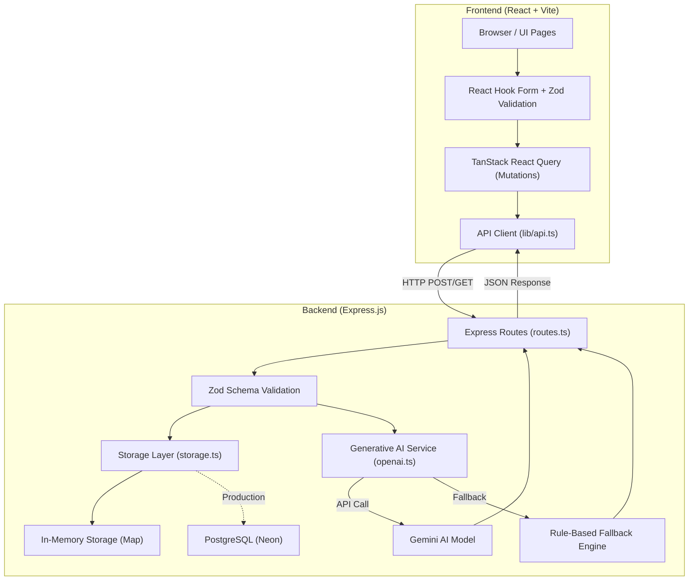
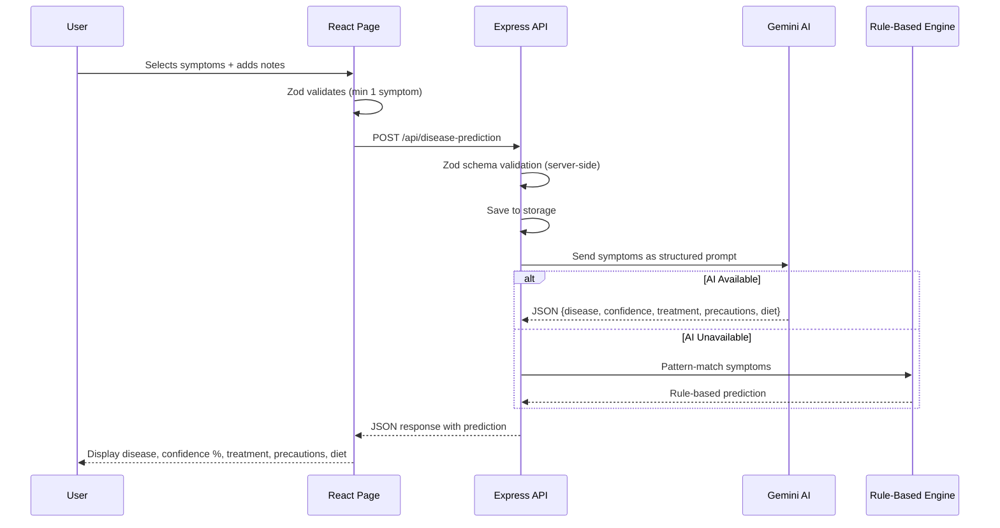
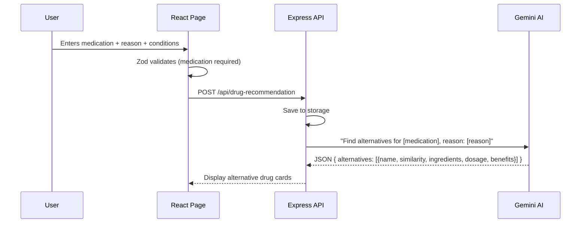
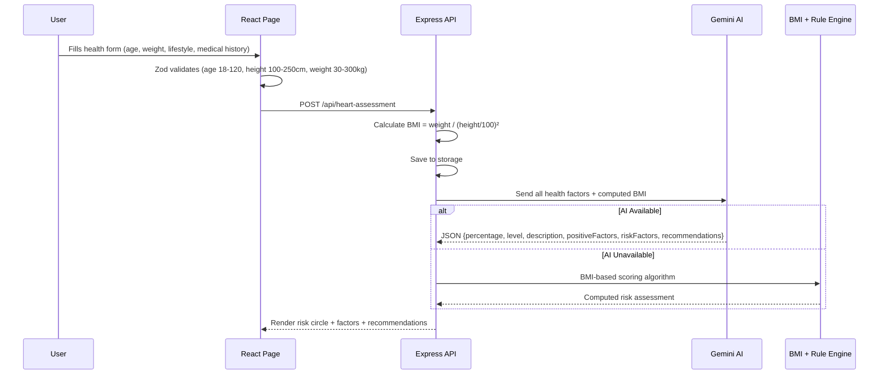
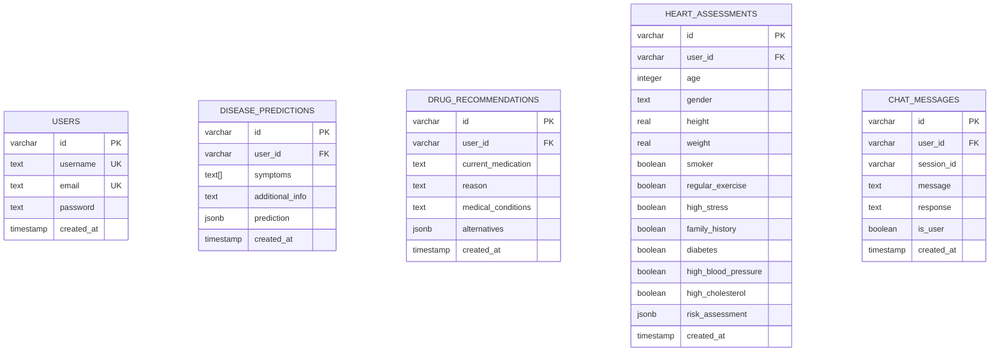

# 🏥 MediScan AI — Intelligent Healthcare Platform

MediScan AI is a **full-stack, AI-powered healthcare intelligence platform** that provides personalized medical services. It is built as a monorepo containing both a React frontend and an Express.js backend, all written in TypeScript, and leverages Google's Gemini AI for medical intelligence.

> [!IMPORTANT]
> **Medical Disclaimer**: This platform is for **educational and demonstration purposes only**. It should never replace professional medical advice, diagnosis, or treatment. Always consult qualified healthcare providers for medical decisions.

---

## 📌 Table of Contents

1. [Project Overview](#project-overview)
2. [Tech Stack](#tech-stack)
3. [Architecture Overview](#architecture-overview)
4. [Core Features](#core-features)
   - [Disease Prediction System](#1-disease-prediction-system)
   - [AI Drug Recommendation System](#2-ai-drug-recommendation-system)
   - [Heart Disease Risk Assessment](#3-heart-disease-risk-assessment)
   - [MediBot (AI Chatbot)](#4-medibot-ai-health-chatbot)
5. [Database Schema](#database-schema)
6. [Offline Fallback System](#offline-fallback-system)
7. [Getting Started](#getting-started)

---

## Project Overview

The platform offers **4 core features**:

| # | Feature | What It Does |
|---|---------|-------------|
| 1 | **Disease Prediction** | Analyzes user-selected symptoms with AI to predict potential diseases |
| 2 | **Drug Recommendations** | Finds alternative medications using NLP-based similarity matching |
| 3 | **Heart Risk Assessment** | Calculates cardiovascular risk from health/lifestyle inputs using AI + BMI scoring |
| 4 | **MediBot Chatbot** | Conversational AI assistant for medical Q&A, powered by Gemini |

---

## Tech Stack

### Frontend

| Technology | Purpose |
|-----------|---------|
| **React 18** & **TypeScript** | Core UI library & static type safety |
| **Vite** | Lightning-fast dev server with HMR + production bundler |
| **Tailwind CSS** | Utility-first CSS framework for styling |
| **shadcn/ui** & **Radix UI** | Accessible, unstyled UI components |
| **TanStack React Query** | Server state management — caching, fetching, mutations |
| **React Hook Form** & **Zod** | Performant form state management & validation |
| **Wouter** | Lightweight client-side router |
| **Framer Motion** & **Recharts** | Animations and Data visualization |

### Backend

| Technology | Purpose |
|-----------|---------|
| **Express.js** & **TypeScript** | HTTP server + RESTful API routing |
| **Google Gemini SDK** | AI engine for all intelligent features |
| **Drizzle ORM** | Type-safe SQL query builder + migrations |
| **PostgreSQL (Neon)** | Primary relational database (serverless hosting) |
| **ESBuild** & **tsx** | TypeScript bundling and execution |

---

## Architecture Overview



### How a Typical Request Flows:

1. **User fills a form** on the frontend (e.g., selects symptoms)
2. **React Hook Form** captures + **Zod validates** the input client-side
3. **TanStack Query mutation** sends a `POST` request to the Express API
4. **Express route** validates the body again with the shared Zod schema
5. **Storage layer** saves the record (in-memory Map or PostgreSQL)
6. **AI service** sends the data to Gemini with a tailored system prompt
7. **Gemini returns** a structured JSON response
8. If the AI fails → **fallback engine** generates a rule-based response
9. **Express sends** the combined result back to the frontend

---

## Core Features

### 1. Disease Prediction System

The user selects symptoms from a predefined list of 20 common symptoms (Fever, Headache, Cough, etc.) and optionally adds free-text notes. The system then uses AI to predict the most likely disease, along with treatment recommendations, precautions, and dietary advice.



| Aspect | How It Works |
|--------|-------------|
| **Input** | Array of symptom strings + optional free-text `additionalInfo` |
| **AI Technique** | **Prompt Engineering** — Symptoms are sent to the AI with a strict medical system prompt. |
| **Response Format** | Forced JSON returning `disease`, `confidence` (0-100%), `treatment`, `precautions` (array), and `diet`. |
| **Fallback** | Rule-based symptom pattern matching (e.g., `fever + cough` → "Upper Respiratory Infection"). |

---

### 2. AI Drug Recommendation System

The user enters a current medication name, selects a reason for wanting an alternative (side effects, cost, etc.), and optionally lists medical conditions. The AI then finds alternative medications with similarity scores.



| Aspect | How It Works |
|--------|-------------|
| **Input** | `currentMedication` (string), `reason` (from 6 predefined options), `medicalConditions` (free text) |
| **AI Technique** | **NLP + Structured Prompting** — AI acts as a pharmaceutical assistant, analyzing drug properties and therapeutic effects. |
| **Similarity Score** | AI returns a `similarity` percentage (0-100%) for each alternative, conceptually based on cosine similarity of drug properties. |
| **Fallback** | Generates generic versions (85% similarity) and extended-release formulations (90% similarity) based on the input string. |

---

### 3. Heart Disease Risk Assessment

The user fills in personal health data (age, gender, height, weight) and checks lifestyle factors and medical history. The system calculates a **heart disease risk percentage** with a detailed breakdown.



| Aspect | How It Works |
|--------|-------------|
| **Input Fields** | `age`, `gender`, `height`, `weight`, `smoker`, `regularExercise`, `highStress`, `familyHistory`, `diabetes`, `highBloodPressure`, `highCholesterol` |
| **BMI Calculation** | `BMI = weight / (height_in_meters)²` — computed server-side before sending to AI |
| **AI Technique** | **Multi-factor Risk Analysis via Prompt Engineering** — All patient data is sent as a structured profile. |
| **Fallback** | Weighted additive risk model. Base Risk 15%, plus additions (e.g., smoker +15%, BMI > 30 +6%). |

---

### 4. MediBot (AI Health Chatbot)

A real-time conversational AI chatbot where users can ask medical questions. It maintains a chat session with message history.

| Aspect | How It Works |
|--------|-------------|
| **Session Management** | Each chat page visit creates a unique `sessionId` — messages are grouped by session |
| **AI Technique** | **Conversational AI with System Prompting** — System prompt defines MediBot's persona, guidelines, and ethical boundaries |
| **System Prompt Role** | Instructed to: provide evidence-based info, include medical disclaimers, suggest professional consultation, and never provide specific diagnoses |
| **Fallback** | Returns a templated educational response acknowledging the question and citing high traffic |

---

## Database Schema



The application uses a **Strategy Pattern** for storage:
- **Development**: `MemStorage` class (in-memory mapping)
- **Production**: PostgreSQL via Drizzle ORM

---

## Offline Fallback System

A key design decision in this project is the **dual-mode AI system**. Every AI-powered feature has a local fallback path:

```mermaid
graph TD
    A["User Request"] --> B{"Gemini API Available?"}
    B -->|Yes| C["Gemini AI Analysis"]
    B -->|No (API error / offline)| D["Rule-Based Fallback"]
    C --> E["Return Response"]
    D --> E
    E --> F["Frontend Renders Result"]
```

| Feature | Fallback Method |
|---------|----------------|
| Disease Prediction | Keyword pattern matching on symptom text → maps to predefined diseases |
| Drug Recommendations | Generates generic + extended-release variants of the input drug |
| Heart Assessment | Weighted additive BMI-based scoring algorithm (base 15% + per-factor weights) |
| MediBot Chat | Returns a templated educational response acknowledging the question |

*All fallback responses are clearly marked with `(Demo)` labels so users know they're not receiving real AI analysis.*

---

## Getting Started

### Prerequisites
- Node.js (v18+)
- PostgreSQL (Optional: System defaults to in-memory storage if omitted)

### Installation
1. Clone the repository
   ```bash
   git clone https://github.com/Samarjamal326/Mediscanai.git
   cd Mediscanai
   ```
2. Install dependencies
   ```bash
   npm install
   ```
3. Set up environment variables
   Create a `.env` file in the root directory and add your API keys:
   ```env
   DATABASE_URL=your_postgresql_url
   GEMINI_API_KEY=your_gemini_api_key
   ```
4. Start the development server
   ```bash
   npm run dev
   ```

---
*Built with ❤️ for modern healthcare technology.*
